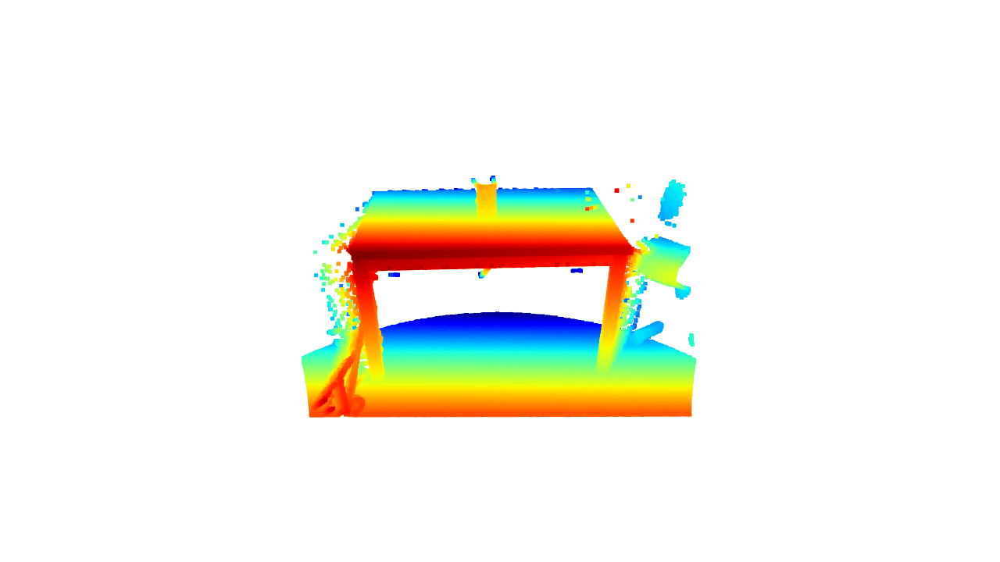
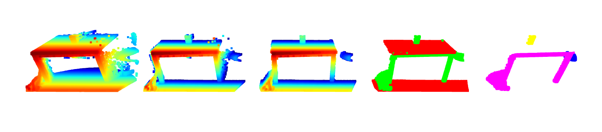

# Caldera3D 🌋

**An ultra-fast 3D point cloud processor designed for autonomous manipulator bin-picking tasks. Written in C++ with Python bindings.**

  

## Core Features & Processing Pipeline

Caldera3D processes point clouds through a highly optimized pipeline, designed step-by-step for industrial reliability:
1) **Data Ingestion & Setup:** Fast 3D Point Cloud parsing (`.ply`) with efficient internal data structure handling.
2) **Workspace Cropping:** Pass-Through Filtering to immediately discard out-of-bounds data.
3) **Spatial Acceleration:** Custom Kd-Tree data structure enabling fast Radius and K-NN searches.
4) **Downsampling & Noise Reduction:** Density reduction via Voxel Grid filtering, followed by high-performance Statistical Outlier Removal (SOR) to eliminate floating artifacts.
5) **Advanced Scene Parsing:** Multi-Plane RANSAC segmentation. Identifies and removes large environmental planes (floors, walls) and extracts the exact mathematical equation of the work table surface.
6) **Object Extraction:** Euclidean Cluster Extraction to segment the remaining point cloud into distinct, isolated items.
7) **Spatial Heuristics:** Centroid-based spatial filtering - ensures only objects resting above the detected table plane are processed.
8) **Dimensional Analysis & Target Matching:** Principal Component Analysis (PCA) is used to compute accurate Oriented Bounding Boxes (OBB). The engine calculates exact dimensions (L/W/H in mm) to find and match specific items requested by a factory PLC (e.g., "find the 20x15 cm package").
9) **Robotic Integration (Grasp Pose Estimation):** Intelligent 6-DoF grasp calculation that determines the safest approach angle to avoid table/object collisions, outputting Universal TCP coordinates and stroke limits for parallel jaw grippers.
10) **Debugging Tools:** Includes complementary Python scripts utilizing Open3D for visual verification of the C++ pipeline outputs.
  

  

## License
This project is licensed under the terms of the MIT license. See the [LICENSE](LICENSE) file for details.
